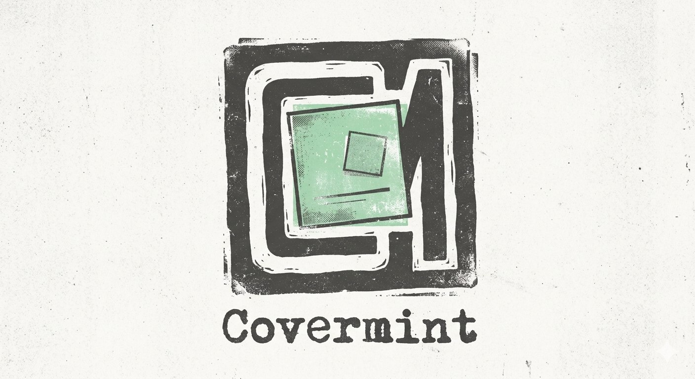

# Covermint

<p align="center">
  
</p>

`covermint` shows the current media cover art as a wallpaper-adjacent **Wayland layer-shell surface**.

Instead of editing your wallpaper file, it opens a small GTK window on the `background` or `bottom` layer so the artwork feels pinned to the desktop and stays behind normal app windows.

## Status

This repo is still an early spike, but it already works for the basic flow:

- subscribes to MPRIS D-Bus change signals and keeps a reconciled session-bus snapshot of player state
- downloads the current artwork
- renders it with GTK4
- places it on a selected monitor
- keeps it behind normal windows via `gtk4-layer-shell`
- hides itself when nothing useful is playing

## Current features

- flexible monitor targeting and discovery, including `auto`, `internal`, `external`, numeric indices, and field-based name matching
- fixed artwork frame sizing and placement controls for presets, per-axis offsets, and symmetric margins
- styling controls for borders, rounded corners, layer selection, and overall artwork opacity
- metadata overlays around the cover: artist on top and title on the left, with truncation, per-character animations, and template-based text sections
- `none`, `fade`, `flip`, `hinge`, edge-anchored `slide`, and same-edge `cover` transitions with configurable timing and eased motion
- local caching for remote artwork, including configurable size/count limits and `file://` support
- optional live synced lyrics in a separate frame with configurable layouts: `singleline` (compact) and `multiline` (left-side panel with centered current-line emphasis, smooth scroll support, and distance-based fading)
- player selection/discovery from session-bus MPRIS names, signal-driven updates, low-frequency reconciliation, and optional paused-state visibility
- a small embedded startup splash using the grungy Covermint logo, centered at about two thirds of the artwork frame and shown briefly above the first resolved state

For the exact flag surface, use the **CLI reference** below.

## Requirements

### Runtime

- Linux Wayland session
- a compositor with `layer-shell` support
- an MPRIS-compatible player exposing `mpris:artUrl` on the session bus
- network access for remote artwork URLs

### Build

- recent Rust toolchain
- GTK 4.8+ development libraries
- `gtk4-layer-shell` development libraries

Package names vary by distro, so the README intentionally stays generic instead of assuming one specific setup.

## Build and run

```bash
cargo run --release -- --list-monitors
cargo run --release -- --list-players
cargo run --release -- --monitor auto
```

Useful examples:

```bash
cargo run --release -- --monitor auto --layer background
cargo run --release -- --monitor 0 --placement top-left --margin 32
cargo run --release -- --monitor internal --placement top-left --margin 32
cargo run --release -- --monitor HDMI-A-1 --placement center --offset-y -40
cargo run --release -- --monitor HDMI-A-1 --width 520 --height 420 --placement bottom-right --offset-x 64 --offset-y 64
cargo run --release -- --monitor auto --border-width 2 --border-color 'rgba(255,255,255,0.28)' --corner-radius 18 --opacity 0.92
# tip: rounded corners tend to look best around --corner-radius 12..24 for medium artwork sizes
cargo run --release -- --monitor auto --transition fade --transition-ms 220
cargo run --release -- --monitor auto --transition flip --transition-ms 220
cargo run --release -- --monitor auto --transition hinge --transition-ms 260
cargo run --release -- --monitor auto --placement bottom-right --transition slide --transition-ms 240
cargo run --release -- --monitor auto --placement bottom-right --transition cover --transition-ms 240
cargo run --release -- --monitor auto --player vlc --poll-seconds 2
cargo run --release -- --monitor auto --player auto
cargo run --release -- --monitor auto --show-paused
cargo run --release -- --monitor auto --no-cache
cargo run --release -- --monitor auto --cache-max-files 64 --cache-max-mb 128
cargo run --release -- --monitor auto --show-lyrics --lyrics-font-size 26 --lyrics-color 'rgba(255,255,255,0.98)' --lyrics-background 'rgba(0,0,0,0.45)'
# runtime toggle commands for an already-running instance:
cargo run --release -- --lyrics-toggle
cargo run --release -- --lyrics-on
cargo run --release -- --lyrics-off
```

## Configuration (`~/.config/covermint/config.toml`)

All runtime command-line options are available in config form via `~/.config/covermint/config.toml`.

Rule of thumb:
- put your defaults in config
- pass CLI flags when you want one-off overrides
- CLI always wins over config for the current run

Quick start:

```bash
covermint --init-config
# or: cargo run --release -- --init-config
```

This copies the bundled commented template from:

- `contrib/config/covermint.config.toml`

to:

- `~/.config/covermint/config.toml`

Top-level config keys mirror CLI flags with snake_case names, for example:
- `monitor`, `player`, `size`, `width`, `height`, `artwork_fit`, `placement`
- `offset_x`, `offset_y`, `margin`
- `border_width`, `border_color`, `corner_radius`, `opacity`
- `transition`, `transition_ms`, `poll_seconds`
- `show_paused`, `no_cache`, `cache_max_files`, `cache_max_mb`, `layer`
- `lyrics.enabled`, `lyrics.layout`, `lyrics.lines_visible`, `lyrics.panel_width`, `lyrics.smooth_scroll`
- `lyrics.font_family`, `lyrics.font_size_px`, `lyrics.text_color`, `lyrics.active_line_color`, `lyrics.background_color`, `lyrics.padding_px`

`artwork_fit` values:
- `contain` keeps full art (possible letterboxing)
- `cover` fills frame with crop (default)
- `fill` stretches to fill (distorts)

Metadata-specific capabilities:
- supported template fields: `{{artist}}`, `{{title}}`, `{{album}}`, `{{trackNumber}}`, `{{length}}`, `{{position}}` (`{{timestamp}}` alias)
- `{{position}}` / `{{timestamp}}` uses a smooth internal playback clock while playing and is periodically resynced from MPRIS
- line breaks in templates: `\n`
- template truncation modifiers: `:start`, `:end` (for example `{{title:end}}`)
- animation directions: `tl-br`, `l-r`, `r-l`, `t-b`, `b-t`, `br-tl`

Example:

```toml
[metadata]
enabled = true

[metadata.top]
enabled = true
template = "{{artist}} — {{album}}"
align = "start"
truncate = "end"
band_size_px = 40

[metadata.left]
enabled = true
template = "{{title:end}}"
align = "start"
truncate = "end"
band_size_px = 34

[metadata.animation]
mode = "fade"      # none | typewriter | fade
direction = "tl-br" # tl-br | l-r | r-l | t-b | b-t | br-tl
duration_ms = 700

[metadata.style]
font_family = "Inter, Sans"
font_size_px = 20
font_weight = 700
text_color = "rgba(255,255,255,0.94)"
background_color = "rgba(0,0,0,0.30)"
padding_px = 8
```

Top/left sections can be enabled independently; when only one section is enabled, it stays aligned with the cover bounds.

Lyrics notes:
- lyrics are fetched from LRCLIB (`syncedLyrics` / LRC-style timestamps)
- layout modes:
  - `singleline`: compact one-line strip below the artwork panel
  - `multiline`: left-side panel showing multiple lines, with highlighted current line and distance fade
- `lyrics.lines_visible` controls how many lines are shown in multiline mode
- `lyrics.smooth_scroll = true` interpolates between timestamps for smoother multiline motion
- network fetches happen only while the lyrics panel is enabled/visible
- fetched lyrics are cached at `~/.cache/covermint/lyrics`

## CLI reference

This is the authoritative per-flag reference; the earlier sections stay higher level on purpose.

```text
--monitor auto|internal|external|<index>|#<index>|<name>
                           Pick a monitor by alias, list index (0 or #0), connector, manufacturer, or model substring
--player auto|<name>        MPRIS player name from the session bus; auto prefers playing players and then players with artwork
--size <px>                 Shorthand for setting both --width and --height
--width <px>                Artwork width in pixels
--height <px>               Artwork height in pixels
--placement <preset>        One of: top-left, top, top-right, left, center, right, bottom-left, bottom, bottom-right
                           Also accepts aliases like tl, tc, tr, cl, cr, bl, bc, br, and middle
--offset-x <px>             Horizontal offset; positive moves inward from the chosen side or away from center
--offset-y <px>             Vertical offset; positive moves inward from the chosen side or away from center
--margin <px>               Shorthand for setting both --offset-x and --offset-y
--border-width <px>         Border width in pixels
--border-color <css-color>  Border color, including alpha-capable values like rgba(...)
--corner-radius <px>        Corner radius in pixels
--opacity <0.0-1.0>         Overall artwork opacity
--transition none|fade|flip|hinge|slide|cover Artwork transition style (`slide` and `cover` require an edge-adjacent placement, so `center` is rejected)
--transition-ms <n>         Transition duration in milliseconds
--poll-seconds <n>          UI refresh interval (also used to derive low-frequency MPRIS reconciliation cadence)
--show-paused               Keep the last artwork visible while playback is paused
--no-cache                  Disable remote artwork cache reads and writes
--cache-max-files <n>       Cap the remote artwork cache entry count (default: 128)
--cache-max-mb <n>          Cap the remote artwork cache size in MiB (default: 256)
--layer background|bottom   Choose the layer-shell layer (`bottom` is more resilient if your wallpaper tool recreates background surfaces)
--show-lyrics               Enable the separate live lyrics panel
--hide-lyrics               Disable the separate live lyrics panel
--lyrics-layout singleline|multiline Lyrics panel layout mode
--lyrics-lines <n>          Number of visible lines in multiline mode
--lyrics-panel-width <px>   Width of multiline lyrics panel
--lyrics-smooth-scroll      Smoothly interpolate multiline scrolling between timestamps
--lyrics-step-scroll        Disable interpolation (step between lines)
--lyrics-font <family>      Lyrics font family
--lyrics-font-size <px>     Lyrics font size in pixels
--lyrics-color <css-color>  Lyrics text color
--lyrics-active-color <css-color> Active/current line color (multiline)
--lyrics-background <css-color> Lyrics panel background color
--lyrics-on                 Send runtime command to show lyrics panel in an already-running instance
--lyrics-off                Send runtime command to hide lyrics panel in an already-running instance
--lyrics-toggle             Send runtime command to toggle lyrics panel in an already-running instance
--init-config               Write the bundled example config to ~/.config/covermint/config.toml (fails if file already exists)
--list-monitors             Print detected monitors and exit
--list-players              Print detected MPRIS player names and exit
--help, -h                  Print usage and exit successfully
```

All runtime options can be configured via `~/.config/covermint/config.toml`.
Use `--init-config` to install the starter config there.

`auto` prefers an internal monitor and otherwise falls back to the first detected monitor. `external` prefers the first non-internal monitor and otherwise also falls back to the first detected monitor. If an explicit monitor selector cannot be resolved, Covermint lets the compositor choose and logs that fallback. Use `--list-monitors` to see the connector and model/manufacturer strings that matching can target.

Cache note: the default bounded cache reduces repeated artwork downloads while still trimming old or cold entries. Use `--no-cache` if you prefer stateless artwork fetches instead of reuse.

Lyrics cache note: synced lyrics are cached separately under `~/.cache/covermint/lyrics` and are only fetched from the network while the lyrics panel is enabled/visible.

## Current limitations

- updates are signal-driven, but a low-frequency reconciliation path is still retained for robustness
- the startup splash is intentionally brief and always yields to artwork after a short fade
- placement follows monitor changes on the polling interval, not instantly via display event subscriptions
- some players, including Spotify, often expose artwork around `640x640`
- artwork is scaled to the configured frame size in both directions; tune it with `--size`, `--width`, and `--height`
- automatic player selection now prefers playing players and then players with artwork, and it depends on what MPRIS names are visible on the session bus
- paused artwork stays hidden unless `--show-paused` is enabled
- the cache is local-only and bounded by simple LRU-style file-count and size limits when enabled
- only `http`, `https`, and `file` artwork URLs are supported right now
- `flip` and `hinge` are GTK-friendly pseudo-3D transitions rather than true compositor/GL transforms
- `slide` follows the nearest anchored edge; corners prefer the horizontal edge so right-corner placements get the intended side-swap motion
- `cover` uses that same edge anchor too, but the incoming artwork slides in solid from that same edge above the fading outgoing artwork
- deeper 3D transition notes live in `docs/transitions-3d.md`
- metadata overlays are currently template/config driven only (no dedicated metadata CLI flags yet), and malformed template placeholders are ignored with startup warnings/fallback behavior
- synced lyrics depend on upstream LRCLIB matches; some tracks may legitimately return no synced lyrics

## Troubleshooting

### Wallpaper tools hiding the artwork layer

If your wallpaper daemon or periodic wallpaper-change script recreates its own background-layer surface, it can temporarily cover Covermint when you run Covermint with `--layer background`.

Covermint now re-presents its background-layer surface on refresh so it can recover, but if you want the most stable behavior with wallpaper tools, prefer:

```bash
cargo run --release -- --monitor auto --layer bottom
```

`bottom` still stays behind normal app windows while sitting above background wallpapers.

### Mesa / Intel renderer warnings

If you see warnings like these on stderr:

```text
MESA-INTEL: warning: ... support more multi-planar formats with DRM modifiers
MESA-INTEL: warning: ... support YUV colorspace with DRM format modifiers
```

those are emitted by the Mesa Intel graphics stack rather than by Covermint itself. If the artwork still renders correctly, they are usually harmless.

If you want to try a different GTK renderer path, run Covermint with one of these environment overrides:

```bash
GSK_RENDERER=ngl cargo run --release -- --monitor auto --layer background
# or, on setups where `ngl` is not available:
GSK_RENDERER=gl cargo run --release -- --monitor auto --layer background
```

## Running as a user service

An example systemd user unit is included at:

- `contrib/systemd/covermint.service`

Suggested setup:

```bash
cargo install --path . --root ~/.local
mkdir -p ~/.config/systemd/user
cp contrib/systemd/covermint.service ~/.config/systemd/user/
$EDITOR ~/.config/systemd/user/covermint.service
systemctl --user daemon-reload
systemctl --user enable --now covermint.service
```

The example unit uses `%h/.local/bin/covermint`, which resolves to `~/.local/bin/covermint` for a user service. You will probably want to customize the `ExecStart=` line for your monitor, placement, size, transition settings, cache policy, and binary path.

## Branding assets

- `assets/branding/covermint-logo-grunge.png` — grungy Covermint logo embedded into the startup splash and available for branding use

## Ticket tracking with Beads

This project uses **Beads** for local ticket tracking.

Useful commands:

```bash
br list
br ready
br show sp-czm
br show <id>
```

The live Beads backlog is the source of truth, so prefer those commands over copying ticket status into the README.

To add more work:

```bash
br create --title "Your feature here" --type feature --priority P2
```
